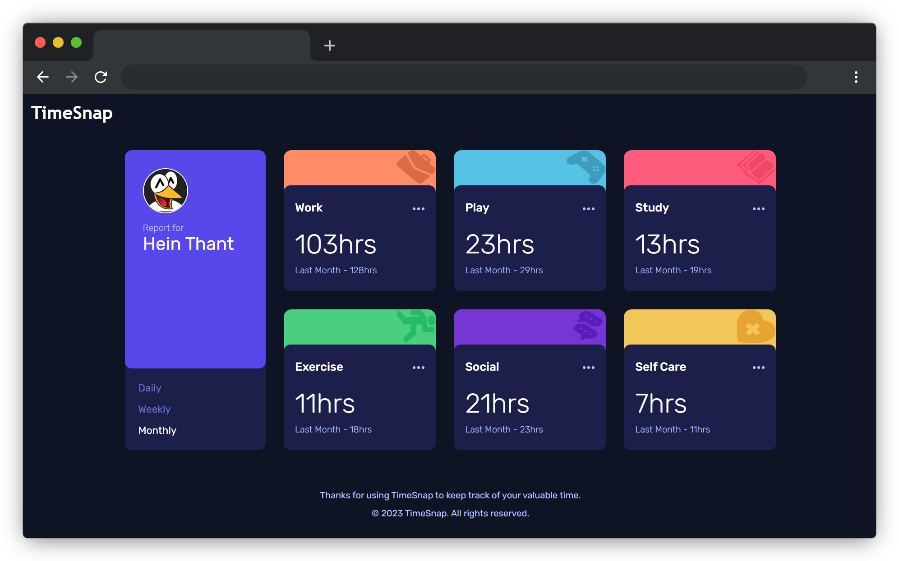

<a name="readme-top"></a>
[](https://github.com/IndieCoderMM/time-snap/graphs/contributors)
[](https://github.com/IndieCoderMM/time-snap/commits/main)
[](https://github.com/IndieCoderMM/time-snap/stargazers)
[](https://github.com/IndieCoderMM/time-snap/issues)
[](https://github.com/IndieCoderMM/time-snap/blob/main/LICENSE)

<details>
<summary>Table of Contents</summary>

- [⏰ Time Snap](#-time-snap)
  - [📸 Screenshot ](#-screenshot-)
  - [🎯 Challenge  ](#-challenge--)
  - [🔗 Links](#-links)
  - [📘 Getting Started  ](#-getting-started--)
    - [📋 Prerequisites](#-prerequisites)
    - [📂 Setup](#-setup)
    - [📥 Installation](#-installation)
    - [💻 Usage](#-usage)
  - [👨‍🚀 Author  ](#-author--)
  - [⛳ Future Features  ](#-future-features--)
  - [🤝 Contribution  ](#-contribution--)
  - [💖 Show Your Support  ](#-show-your-support--)
  - [📜 License ](#-license-)
</details>

# ⏰ Time Snap<a name="about-project"></a>
**Developed In: 03:21:02**

This is a solution to the [Time tracking dashboard challenge on Frontend Mentor](https://www.frontendmentor.io/challenges/time-tracking-dashboard-UIQ7167Jw).

**TimeSnap** is a modern and user-friendly time-tracking app created using the React. With its intuitive interface and powerful features, TimeSnap helps you become more productive and efficient by giving you insights into how you're spending your time.

<p align="right">(<a href="#readme-top">back to top</a>)</p>

## 📸 Screenshot <a name="screenshot"></a>



<p align="right">(<a href="#readme-top">back to top</a>)</p>

## 🎯 Challenge  <a name="key-features"></a>

Users should be able to:

- View the optimal layout for the site depending on their device's screen size
- See hover states for all interactive elements on the page
- Switch between viewing Daily, Weekly, and Monthly stats

<p align="right">(<a href="#readme-top">back to top</a>)</p>

## 🔗 Links

- Solution URL: [Submission](https://www.frontendmentor.io/solutions/time-tracking-dashboard-built-with-react-xPLAnIZCTr)
- Live Site URL: [Live Website](https://indiecodermm.github.io/time-snap/)

<p align="right">(<a href="#readme-top">back to top</a>)</p>

## 📘 Getting Started  <a name="getting-started"></a>

To run this project locally, follow these steps.

### 📋 Prerequisites

In order to run this project you need [Node](https://nodejs.org/en) installed on your machine.

### 📂 Setup

Clone this repository to your desired foler.

```sh
cd my-project
git clone git@github.com:IndieCoderMM/time-snap.git .
```

### 📥 Installation

Intall this project with:

```sh
npm install
```

### 💻 Usage

To run the project, execute the following command:

```sh
npm start
```

<p align="right">(<a href="#readme-top">back to top</a>)</p>

## 👨‍🚀 Author  <a name="author"></a>

I am always looking for ways to improve my project. If you have any suggestions or ideas, I would love to hear from you.

**Hein Thant**

[](https://github.com/IndieCoderMM)
[](https://linkedin.com/in/hthantoo)
[](mailto:hthant00chk@gmail.com)

<p align="right">(<a href="#readme-top">back to top</a>)</p>

## ⛳ Future Features  <a name="future-features"></a>

- [ ] Add new entry
- [ ] Edit records
- [ ] User profile

<p align="right">(<a href="#readme-top">back to top</a>)</p>

## 🤝 Contribution  <a name="contribution"></a>

Contributions, issues, and feature requests are welcome!

<p align="right">(<a href="#readme-top">back to top</a>)</p>

## 💖 Show Your Support  <a name="support"></a>

If you like this project, please consider giving it a ⭐.

<p align="right">(<a href="#readme-top">back to top</a>)</p>

## 📜 License <a name="license"></a>

This project is [MIT](./LICENSE) licensed.

<p align="right">(<a href="#readme-top">back to top</a>)</p>
